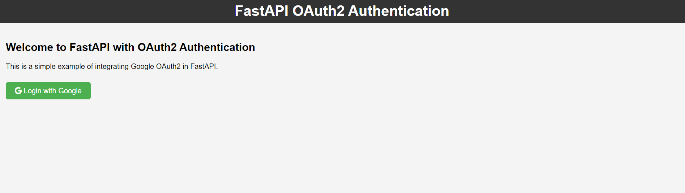

# FastAPI Google OAuth2 Authentication

This project demonstrates how to integrate Google OAuth2 authentication with a FastAPI application. Users can log in via their Google account, and upon successful authentication, they are redirected to a protected route where a JWT token is generated for secure access.

## Features

- Google OAuth2 authentication using the **authorization code flow**.
- JWT (JSON Web Token) generation for authenticated users.
- FastAPI server with a simple login page.
- CORS support for frontend development.
- User profile data (email and name) fetched from Google. // Fetching Access Token (Type: Bearer)

## Requirements

Before running the project, you need to install the required dependencies.

### Install Dependencies

```bash
pip install -r requirements.txt


GOOGLE_CLIENT_ID=your-client-id
GOOGLE_CLIENT_SECRET=your-client-secret
GOOGLE_DISCOVERY_URL=https://accounts.google.com/.well-known/openid-configuration
SECRET_KEY=your-secret-key
ALGORITHM=HS256
ACCESS_TOKEN_EXPIRE_MINUTES=60


Project_Structure
├── .env               # Environment variables file
├── app.py             # FastAPI app
├── requirements.txt   # Python dependencies
├── templates/
│   ├── index.html     # HTML file for the Google Login page
├── secret_key_generate.py # To generate random secret key or session key
└── README.md          # Project documentation


python main.py // Redirects to specified port 3000
uvicorn app:app --reload // Redirects to port 8000

